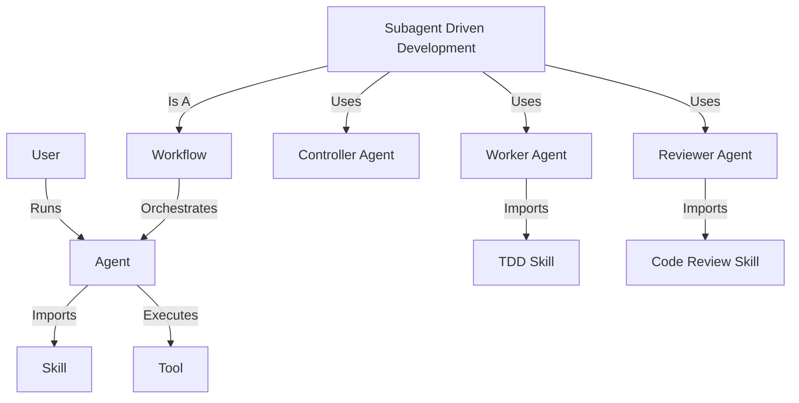

# Ontology: The Superpowers System on mdflow

This document defines the entities and relationships within the Superpowers system as it is implemented on the `mdflow` architecture.

## 1. Core Entities

### 1.1 Agent (`*.model.md`)
An **Agent** is an executable Markdown file that defines a specific AI persona and task.
*   **Active:** It is the entry point for execution (e.g., `mdflow agents/planner.claude.md`).
*   **Configurable:** Uses YAML frontmatter for parameters (`model`, `temperature`, `_inputs`).
*   **Composable:** Can import Skills and other partials.

### 1.2 Skill (`SKILL.md` or `*.md`)
A **Skill** is a passive Markdown file containing reusable instructions, patterns, or knowledge.
*   **Passive:** It is not executed directly but imported into an Agent (e.g., `@import skills/tdd`).
*   **Modular:** Focuses on a single capability (e.g., "Test Driven Development", "Systematic Debugging").
*   **Structure:**
    *   **Frontmatter:** `name`, `description` (for discovery).
    *   **Body:** The actual prompt instructions.

### 1.3 Workflow
A **Workflow** is a sequence of Agents or Steps orchestrated to achieve a larger goal.
*   **Implementation:** In `mdflow`, workflows are typically shell scripts (`dispatch.sh`) or pipes (`step1 | step2`) that connect stateless Agents.
*   **Examples:** "Brainstorming -> Planning -> Execution", "Subagent Driven Development".

### 1.4 Tool
A **Tool** is an external capability invoked by an Agent.
*   **Native:** Standard Unix tools (`git`, `grep`, `cat`).
*   **Shimmed:** Adapters for legacy Superpowers tools (e.g., `TodoWrite` -> `update_plan`).
*   **mdflow Specific:** The `mdflow` CLI itself, used for recursion ("Agent spawning Agent").

## 2. Super Features (The "Superpowers")

These are high-level capabilities provided by the system, often implemented as complex Workflows or specialized Agents.

### 2.1 Brainstorming
*   **Type:** Workflow (Interactive Agent)
*   **Goal:** Turn vague ideas into structured Design Documents.
*   **Mechanism:** Uses `_inputs` for Socratic questioning.
*   **Artifact:** `DESIGN.md`.

### 2.2 Planning
*   **Type:** Agent
*   **Goal:** Convert Design Documents into bite-sized Implementation Plans.
*   **Mechanism:** Reads `DESIGN.md`, outputs `PLAN.md` (or JSON task list).
*   **Artifact:** `PLAN.md`.

### 2.3 Subagent Driven Development (SDD)
*   **Type:** Complex Workflow
*   **Goal:** Execute a plan by dispatching specialized workers for each task.
*   **Mechanism:**
    1.  **Controller:** Reads `PLAN.md`.
    2.  **Dispatcher:** Iterates over tasks.
    3.  **Worker (Implementer):** Executed for each task.
    4.  **Reviewer (Spec & Quality):** Verifies worker output.
*   **Key Requirement:** "Fan-out" parallelism and "Review Loops".

### 2.4 Systematic Debugging
*   **Type:** Skill
*   **Goal:** Enforce a rigorous 4-phase debugging process.
*   **Mechanism:** Injected instruction that forbids "guessing" and requires root cause analysis.

### 2.5 Test Driven Development (TDD)
*   **Type:** Skill
*   **Goal:** Enforce Red-Green-Refactor cycle.
*   **Mechanism:** Injected instruction that forbids writing code before tests.

## 3. Relationships

## 4. Mapping: Legacy to mdflow

| Legacy Concept | mdflow Implementation |
| :--- | :--- |
| `SKILL.md` (metadata) | YAML Frontmatter + Directory Structure |
| `Task` Tool | `mdflow` recursive call / Shell script |
| `TodoWrite` Tool | File IO (`PLAN.md` updates) |
| `find_skills` | `mdflow --list` (future) or `AGENTS.md` index |
| `bootstrap` | `npm install` / Setup script |
