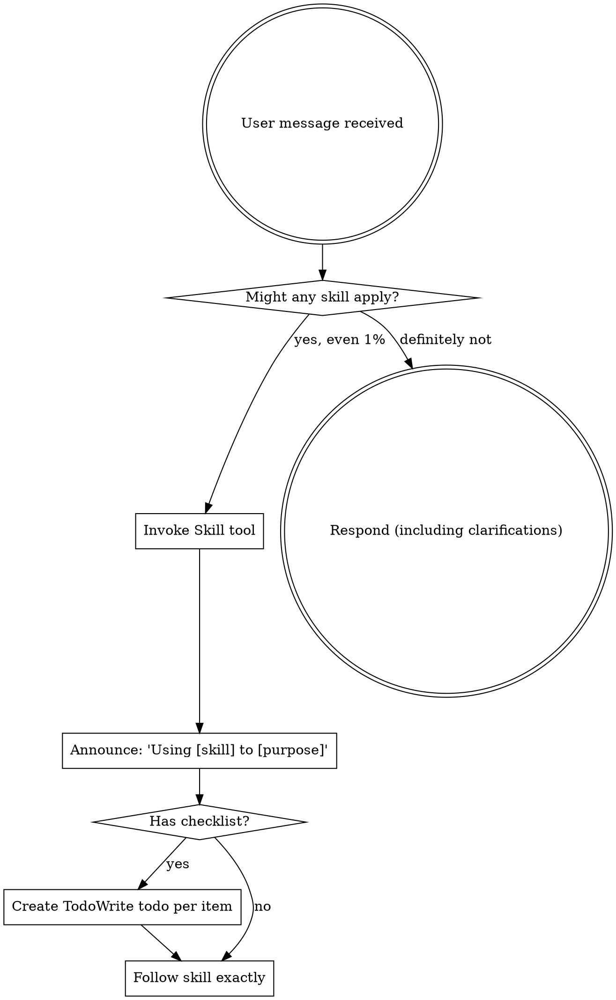

# Getting Started with Skills

## Critical Rules

1. **Use Read tool before announcing skill usage.** The session-start hook does NOT read skills for you. Announcing without calling Read = lying.

2. **Follow mandatory workflows.** Brainstorming before coding. Check for skills before ANY task.

3. **Create TodoWrite todos for checklists.** Mental tracking = steps get skipped. Every time.

## Mandatory Workflow: Before ANY Task

**1. Check skills list** at session start, or run `find-skills [PATTERN]` to filter.

**2. If relevant skill exists, YOU MUST use it:**

- Use Read tool with full path: `${SUPERPOWERS_SKILLS_ROOT}/skills/category/skill-name/SKILL.md`
- Read ENTIRE file, not just frontmatter
- Announce: "I've read [Skill Name] skill and I'm using it to [purpose]"
- Follow it exactly

**Don't rationalize:**
- "I remember this skill" - Skills evolve. Read the current version.
- "Session-start showed it to me" - That was using-skills/SKILL.md only. Read the actual skill.
- "This doesn't count as a task" - It counts. Find and read skills.

**Why:** Skills document proven techniques that save time and prevent mistakes. Not using available skills means repeating solved problems and making known errors.

If a skill for your task exists, you must use it or you will fail at your task.

## Skills with Checklists

If a skill has a checklist, YOU MUST create TodoWrite todos for EACH item.

**Don't:**
- Work through checklist mentally
- Skip creating todos "to save time"
- Batch multiple items into one todo
- Mark complete without doing them

**Why:** Checklists without TodoWrite tracking = steps get skipped. Every time. The overhead of TodoWrite is tiny compared to the cost of missing steps.

**Examples:** skills/testing/test-driven-development/SKILL.md, skills/debugging/systematic-debugging/SKILL.md, skills/meta/writing-skills/SKILL.md

## Announcing Skill Usage

After you've read a skill with Read tool, announce you're using it:

"I've read the [Skill Name] skill and I'm using it to [what you're doing]."

**Examples:**
- "I've read the Brainstorming skill and I'm using it to refine your idea into a design."
- "I've read the Test-Driven Development skill and I'm using it to implement this feature."
- "I've read the Systematic Debugging skill and I'm using it to find the root cause."

**Why:** Transparency helps your human partner understand your process and catch errors early. It also confirms you actually read the skill.

## How to Read a Skill

Every skill has the same structure:

1. **Frontmatter** - `when_to_use` tells you if this skill matches your situation
2. **Overview** - Core principle in 1-2 sentences
3. **Quick Reference** - Scan for your specific pattern
4. **Implementation** - Full details and examples
5. **Supporting files** - Load only when implementing

**Many skills contain rigid rules (TDD, debugging, verification).** Follow them exactly. Don't adapt away the discipline.

**Some skills are flexible patterns (architecture, naming).** Adapt core principles to your context.

The skill itself tells you which type it is.

## Instructions ≠ Permission to Skip Workflows

Your human partner's specific instructions describe WHAT to do, not HOW.

"Add X", "Fix Y" = the goal, NOT permission to skip brainstorming, TDD, or RED-GREEN-REFACTOR.

**Red flags:** "Instruction was specific" • "Seems simple" • "Workflow is overkill"

**Why:** Specific instructions mean clear requirements, which is when workflows matter MOST. Skipping process on "simple" tasks is how simple tasks become complex problems.

## Summary

**Starting any task:**
1. Run find-skills to check for relevant skills
2. If relevant skill exists → Use Read tool with full path (includes /SKILL.md)
3. Announce you're using it
4. Follow what it says

**Skill has checklist?** TodoWrite for every item.

**Finding a relevant skill = mandatory to read and use it. Not optional.**

## New Version (To Be Integrated)

---
name: using-superpowers
description: Use when starting any conversation - establishes how to find and use skills, requiring Skill tool invocation before ANY response including clarifying questions
---

<EXTREMELY-IMPORTANT>
If you think there is even a 1% chance a skill might apply to what you are doing, you ABSOLUTELY MUST invoke the skill.

IF A SKILL APPLIES TO YOUR TASK, YOU DO NOT HAVE A CHOICE. YOU MUST USE IT.

This is not negotiable. This is not optional. You cannot rationalize your way out of this.
</EXTREMELY-IMPORTANT>

## How to Access Skills

**In Claude Code:** Use the `Skill` tool. When you invoke a skill, its content is loaded and presented to you—follow it directly. Never use the Read tool on skill files.

**In other environments:** Check your platform's documentation for how skills are loaded.

# Using Skills

## The Rule

**Invoke relevant or requested skills BEFORE any response or action.** Even a 1% chance a skill might apply means that you should invoke the skill to check. If an invoked skill turns out to be wrong for the situation, you don't need to use it.

## Red Flags

These thoughts mean STOP—you're rationalizing:

| Thought | Reality |
|---------|---------|
| "This is just a simple question" | Questions are tasks. Check for skills. |
| "I need more context first" | Skill check comes BEFORE clarifying questions. |
| "Let me explore the codebase first" | Skills tell you HOW to explore. Check first. |
| "I can check git/files quickly" | Files lack conversation context. Check for skills. |
| "Let me gather information first" | Skills tell you HOW to gather information. |
| "This doesn't need a formal skill" | If a skill exists, use it. |
| "I remember this skill" | Skills evolve. Read current version. |
| "This doesn't count as a task" | Action = task. Check for skills. |
| "The skill is overkill" | Simple things become complex. Use it. |
| "I'll just do this one thing first" | Check BEFORE doing anything. |
| "This feels productive" | Undisciplined action wastes time. Skills prevent this. |
| "I know what that means" | Knowing the concept ≠ using the skill. Invoke it. |

## Skill Priority

When multiple skills could apply, use this order:

1. **Process skills first** (brainstorming, debugging) - these determine HOW to approach the task
2. **Implementation skills second** (frontend-design, mcp-builder) - these guide execution

"Let's build X" → brainstorming first, then implementation skills.
"Fix this bug" → debugging first, then domain-specific skills.

## Skill Types

**Rigid** (TDD, debugging): Follow exactly. Don't adapt away discipline.

**Flexible** (patterns): Adapt principles to context.

The skill itself tells you which.

## User Instructions

Instructions say WHAT, not HOW. "Add X" or "Fix Y" doesn't mean skip workflows.
